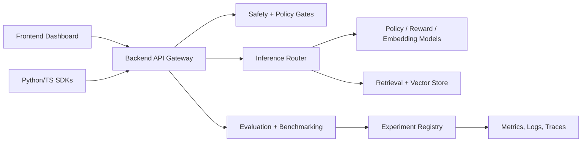

# AlignGPT

AlignGPT is a research-grade alignment platform for building, evaluating, and operating language-model systems with preference learning, retrieval, safety gates, benchmark automation, and web-facing product surfaces.

The repository started as a compact RLHF prototype. It now keeps that useful training logic while organizing the project like a maintainable AI platform: research work, backend services, frontend surfaces, deployment assets, observability, security, evaluation, benchmarks, SDKs, and developer tooling all have explicit ownership.

## System Goals

- Provide a clear RLHF, DPO, reward-modeling, and evaluation path for alignment research.
- Expose alignment workflows through API, CLI, SDK, and web dashboard entry points.
- Make benchmark runs reproducible with tracked configs, manifests, metrics, and reports.
- Keep production concerns visible from day one: auth boundaries, rate limiting, secret hygiene, observability, and deployment topology.
- Preserve optional heavy ML dependencies behind lazy imports so the core package remains import-safe in CI and lightweight development environments.

## Architecture At A Glance



See [ARCHITECTURE.md](ARCHITECTURE.md) for service boundaries, request lifecycle, storage layers, and deployment topology.

## Repository Map

- [research/](research/README.md): alignment methods, reward modeling, ablations, benchmark design, and papers.
- [datasets/](datasets/README.md): ingestion, preprocessing, vectorization, synthetic data, quality control, and registry schemas.
- [models/](models/README.md): model families, adapters, reward models, embeddings, quantization, distillation, and model evaluation plans.
- [agent_system/](agent_system/README.md): planners, memory, tool use, orchestration, multi-agent workflows, autonomous reasoning, and safety constraints.
- [backend/](backend/README.md): API gateway, auth, rate limiting, retrieval, caching, inference routing, queues, feature store, and database contracts.
- [frontend/](frontend/README.md): web dashboard, admin panel, experiment visualizer, benchmark viewer, analytics, and mobile placeholder.
- [deployment/](deployment/README.md): Docker, Kubernetes, Helm, Terraform, nginx, Cloudflare, GPU cluster, and autoscaling assets.
- [infrastructure/](infrastructure/README.md): observability, monitoring, distributed compute, GPU optimization, vLLM, Ray, Kafka, and Redis.
- [benchmarking/](benchmarking/README.md): hallucination, latency, throughput, robustness, bias, adversarial, and reproducibility suites.
- [security/](security/README.md): prompt-injection, jailbreak, PII redaction, access-control, and threat-modeling assets.
- [evaluation/](evaluation/README.md): human feedback, reward scoring, ranking, scientific metrics, and automated evaluation.
- [pipelines/](pipelines/README.md): training, inference, RAG, indexing, retraining, deployment, and scheduled jobs.
- [sdk/](sdk/README.md): Python client, TypeScript client, CLI adapter, and examples.
- [cli/](cli/README.md): operator-oriented entry points for training, deployment, and evaluation.
- [src/aligngpt](src/aligngpt/README.md): lightweight core package used by tests, backend scaffolds, SDKs, and future services.

## Developer Quickstart

```bash
python -m venv .venv
source .venv/bin/activate  # Windows: .venv\Scripts\activate
python -m pip install -U pip
python -m pip install -e ".[dev]"
pytest
```

Optional ML extras are isolated:

```bash
python -m pip install -e ".[ml]"
```

The core package intentionally avoids importing `torch`, `transformers`, or hosted model clients during normal import. Training and generation code load those dependencies only inside task-specific modules.

## API Smoke Run

The backend scaffold exposes a FastAPI app when optional API dependencies are installed:

```bash
python -m pip install -e ".[api]"
uvicorn backend.api_gateway.app:app --reload --port 8000
```

OpenAPI contract notes live in [docs/api/openapi.yaml](docs/api/openapi.yaml).

## Web App Scaffold

The frontend surface is organized under [frontend/web/nextjs_app](frontend/web/nextjs_app). It is a starter product shell for experiment status, benchmark health, safety findings, and deployment readiness. It is intentionally minimal until API contracts stabilize.

## Existing RLHF Logic

The original prototype logic remains available under `src/data`, `src/models`, `src/training`, `src/eval`, and `src/utils`. These modules include prompt building, preference-pair generation, reward modeling, SFT, PPO, DPO, checkpointing, and metric utilities. The new platform skeleton wraps that work in a larger product and research structure instead of discarding it.

## Testing

Fast tests live under [tests/unit](tests/unit) and [tests/integration](tests/integration). They validate configuration loading, safety policy behavior, service contracts, and deterministic benchmark metrics without network downloads. Heavier ML tests should be added behind explicit markers once model artifacts and CI runners are available.

## Screenshots

Product screenshots will be captured from the dashboard once the Next.js app reaches an interactive milestone. Until then, the intended screen inventory is documented in [frontend/web/dashboard/README.md](frontend/web/dashboard/README.md) and [docs/diagrams/system_context.mmd](docs/diagrams/system_context.mmd).

## License

Released under the MIT License. See [LICENSE](LICENSE).
